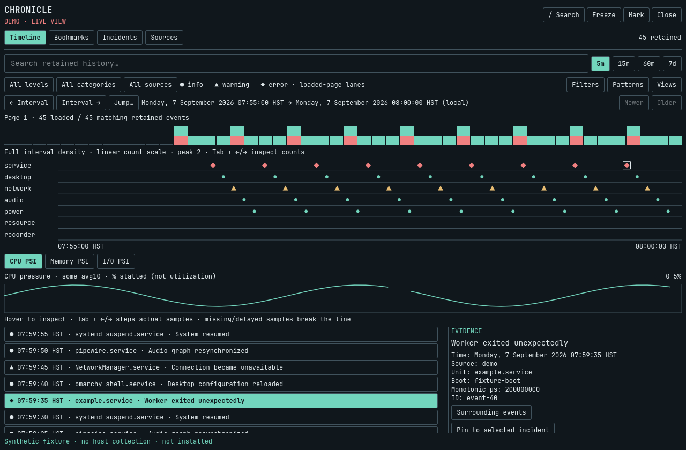

# Chronicle

What changed just before this broke?

Chronicle (`nshkr.chronicle`) is a local-first desktop incident flight recorder
for Omarchy. It brings timestamped evidence, bounded resource history,
bookmarks, before/after comparisons, and saved investigations into one native
panel. Correlation is not proof of causation.



*Full-panel synthetic preview, without an OS titlebar. Native installed
acceptance is pending; regenerate with `make preview`.*

**Status: pre-installation acceptance build.** Implemented and tested outside
the installed desktop. Native installed acceptance is deliberately deferred;
do not enable it in a shared development session without coordinating first.

## Operator capabilities

- **Investigate a moment:** synchronized event lanes, severity shapes, literal
  search across retained records, source/category/level filters, and 5-minute,
  15-minute, hour, or seven-day windows. Exact evidence identity and provenance.
- **Explore complete retained history:** time-filtered pages, full-interval
  density/counts, older/newer navigation, exact-time jumps and bookmark context. Independent
  queries per cockpit; receipt ceilings and explicit retention-loss warnings.
- **Reuse investigations:** quick error/audio/network presets and up to 20
  named durable filter views, without saving stale page cursors.
- **Inspect pressure:** CPU, memory, and I/O PSI traces with actual scales,
  missing-data gaps, pointer inspection and keyboard sample stepping. PSI is
  time stalled, not resource utilization.
- **Keep your place:** freeze a view without stopping recording. Selecting an
  event or scrolling the event list freezes it; Live explicitly returns to new
  evidence. No silent substitution when a selected event disappears.
- **Mark a change:** named persistent bookmarks capture collected scalar
  measurements and their observation time. Compare exact A/B marks with signed
  changes, units and missing-field qualification.
- **Build an investigation:** named incidents, notes, resolve/reopen, pinned
  evidence copies that survive ordinary history retention, explicit removal.
- **Protect human work:** separately acknowledged durable drafts, revision-checked
  note saves, explicit three-version conflict review, and saved-copy inspection.
- **Share deliberately:** metadata-only export by default, opt-in messages and
  notes, full exact-byte preview, expiring confirmation, private local JSON file.
  No upload, clipboard copy, or automatic remediation.
- **Understand coverage:** source health, failed reads, cursor gaps, retention,
  pause state, data age, and disabled sources are visible.

The header follows Tactical Display's native panel conventions: subtitle-sized
title, native body/caption tokens, right-aligned action rail, 8-unit popup
padding and a screen-constrained 1280×840 target. Click and shortcut share one
native panel; there is no alternate overlay presentation.

## Development without installation

Requirements: Python 3.11+ with SQLite JSON support, Node 22+ for model tests,
Qt 6.4+ test tools/modules. Real transport integration additionally requires
Quickshell; native import lint requires a readable Omarchy shell source tree.
There are no pip or npm runtime dependencies.

```sh
git clone https://github.com/nshkrdotcom/omarchy-chronicle.git
cd omarchy-chronicle
git switch feat/chronicle-operator-cockpit
make test          # Python + JS, isolated state and deterministic fixtures
make test-qml      # Offscreen UI and stubbed service-controller tests
make integration   # Real windowless Quickshell ↔ Python, synthetic data
make lint          # Read-only resolution against packaged Omarchy imports
make demo          # Four synthetic page screenshots in /tmp; no visible window
make preview       # Refresh the titlebar-free full-panel README preview.png
make soak          # 60-second synthetic helper soak, 50 panel-state cycles
make live-readonly # Optional one-shot real source read with temporary state
```

None of these targets install a plugin, change shell configuration, register
with the installed shell, reload Omarchy, or manipulate the observed system.
`make integration` uses its own temporary XDG runtime/config/cache/state roots
and removes display/compositor environment access from that child process.

The Python recorder can also be run directly with explicit temporary state:

```sh
bin/chronicle --demo --state-dir /tmp/my-private-chronicle-demo
```

The directory must be new or already private (0700), owned by you, and not a
symlink. The helper accepts JSON commands on stdin and exits on EOF. A demo
requires an explicit state directory to avoid contaminating normal history.
See [the protocol](docs/PROTOCOL.md) for examples.

## Collection and privacy

Default collection reads the accessible **user journal**, plus `/proc/pressure`
and `MemAvailable`. Accessible system-journal reading is an explicit operator
opt-in. Journal-backed network/audio/power/desktop categories are evidence from
those services, **not independent device-state watchers or complete audit logs**.

Persistent state defaults to `$XDG_STATE_HOME/nshkr.chronicle`, or
`~/.local/state/nshkr.chronicle` when unset/relative. Recording continues while
the panel is closed. Pause stops source collection; it does not erase history.

Messages are bounded and redacted before persistence, but generic redaction
cannot recognize every secret. Review all exports before sharing. The journal's
`_HOSTNAME` and `_CMDLINE` fields, other unselected fields, and raw journal objects
are not persisted. Message text and identifiers may still reveal hostnames or
other private context. Existing journal files are never modified.

See [privacy and source coverage](docs/PRIVACY-AND-SOURCES.md),
[operator workflows](docs/OPERATOR-GUIDE.md), and [security reporting](SECURITY.md).

## Acceptance and contributing

[Testing evidence](docs/TESTING.md) separates unit/offscreen/transport results
from the [installed release gate](docs/RELEASE-GATE.md). CI exercises Python
3.11/3.14, Node 22, and offscreen Qt at 1× and 1.5×. It does not prove Wayland
placement, monitor hotplug, or real popup coordination.

The [continuation handoff](docs/CONTINUATION.md) describes the coordinated
installation and human-in-the-loop polish process; installation remains deferred.

The [implementation plan](docs/IMPLEMENTATION-PLAN.md) records research,
architecture and TDD milestones. See [contributing](CONTRIBUTING.md) before
working on the plugin. MIT © 2026 nshkrdotcom.
